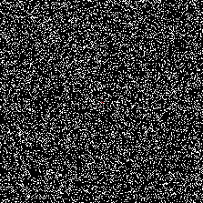
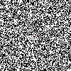

# PHYS 2010 [A01] 
## FINAL PROJECT
------------------------------------------------------------------------------------------------------------------------

### ANSWER

An agent-based model (AVM) is a computational model that simulates the actions and interactions of autonomous agents in order to understand complex systems. To create an AVM for this project, we would need to first define the agents and their behavior. We would then need to define the rules for how the agents interact with each other and with their environment

A cellular Atomaton (CA) is a discreate model that consists of a grid of cells, each of which can be in one of a finite number of states. The states of each cell change over time according to a set of rules that depend on the states of the neighbour cells. To develop a CA for crystal growth, we would have to start by defining the grid and the states of the cells  We would then have to define the rules on how the states of each cell chanegs over time. We would then simulate the evaluation of the CA over time

------------------------------------------------------------------------------------------------------------------------

##### SECTION A

1. ###### Steps to create a AVM for crystal growth
    
    * step 1: **Defining the agents and their behavior**
    In this case, the agents are the particles that perform Brownian motion (random walks) in continuous space. We define the behavior of each particle by specifying the distribution of the distance it moves at each time step. 

    * step 2: **Define the environment**
    The environment is the solution in which the particles move. We define the boundaries of the environment and in this case that could be sonmething like a breaker.

    * step 3: **Define the rules for crystal growth**
    We need to specify when a particle sticks to the crystal. We need to define a threshold distance such that if a particle gets closer than this distance to the seed or the crystal, it sticks and becomes part of the crystal.

    * step 4: **Initialize the model**
    At the start of the simulation, we need to initialize the positions of the particles and the seed. We randomly istribute the particles within the environment and place the seed at a fixed position.
    
    * step 5: **Simulate the motion of the particles**
    At each time step, we update the positions of the particles according to their behavior (random motion).

    *  step 6: **Update the crystal**
    At each time step, you need to check if any particles have gotten close enough to stick to the crystal. If so, we update the crystal accordingly
    
    * step 7: **Repeat steps 5-6 until you reach a stopping condition**
    (e.g., a certain number of time steps have passed or the crystal has reached a certain size or all the liquid has been compleately crystalized).

2. ###### Steps to create a CA for crystal growth

    * step 1: **Define the grid and the states of the cells**
    A Cellular Automaton consists of a grid of cells, each of which can be in one of a finite number of states. In this case, we use a two-dimensional grid and define three states for the cells
        * empty: represent by the integer value of 0
        * particle: represented by the integer value of 1
        * crystal: represented by the initger value of 2

    * Step 2: **Define the rules for the evolution of the CA**
    We then need to specify how the state of each cell changes over time based on the states of its neighboring cells. We define rules such as:
        * a particle moves to an empty neighboring cell in some random direction (up, down, left, right and diagonally) only if it is empty
        * a particle becomes part of the crystal if it is adjacent to a crystal cell.
    
    * Step 3: **Initialize the CA**
    At the start of the simulation, you need to initialize the states of the cells. We randomly distribute particles on the grid and place the impurity at a fixed position. For this example i have chosent to place it in the middle
    
    * Step 4: **Update the CA**
    At each time step, you need to update the state of each cell according to the rules you defined in step 2.

    * step 5: **Repeat step 4 until you reach a stopping condition**
    There can be many stopping conditions, such as a certain number of time steps have passed or the crystal has reached a certain size. For this exapmle, I have chosen to stop at a particular predetermined timestep

------------------------------------------------------------------------------------------------------------------------

##### SECTION B

The souce code for the simulation of crystal groth using Agent-Based Model (ABM) can be found in the file named **ABM.py**
This code was used to generate the *gif* file that you see below in the Agent-Based Model sub-section, of section D

------------------------------------------------------------------------------------------------------------------------

##### SECTION C

The souce code for the simulation of crystal groth using Cellular Automaton (CA) can be found in the file named **CA.py**
This code was used to generate the *gif* file that you see below in the Cellular Automaton sub-section, of section D

------------------------------------------------------------------------------------------------------------------------

##### SECTION D

Both models have their advantages and disadvantages. ABMs can capture more detailed behavior and interactions between agents but can be more computationally intensive. CAs are simpler and faster to simulate but may not capture as much detail. The choice of which model to use would depend on your specific goals and requirements. In this particular case, AVM simulation have a continuous space, where in the CA it is discreatised.

The simulation of  crystal groth from a impurity in a liquid using Cellular Automaton (CA) is as follows,

The simulation of  crystal groth from a impurity in a liquid using Agent-Based Model (ABM) is as follows,

------------------------------------------------------------------------------------------------------------------------

##### to do

* check and if needed change varibale names
* add docstring to each function
* spell check the readme.md
* add name and ID
* possible to add labels?
* change fps?
